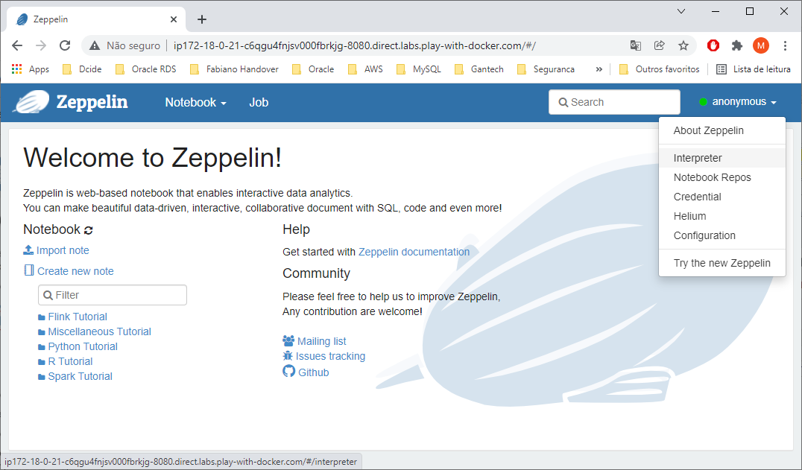
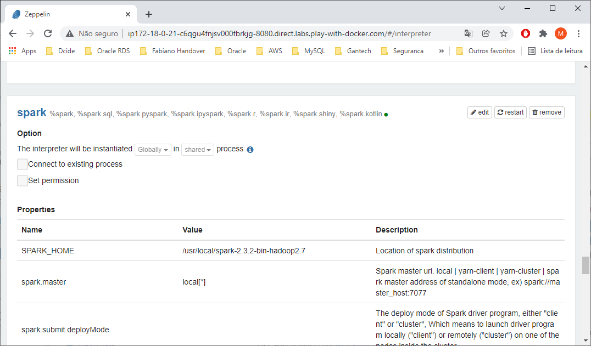
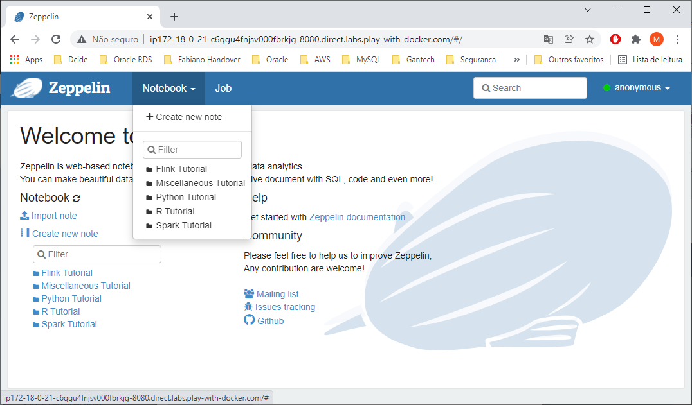
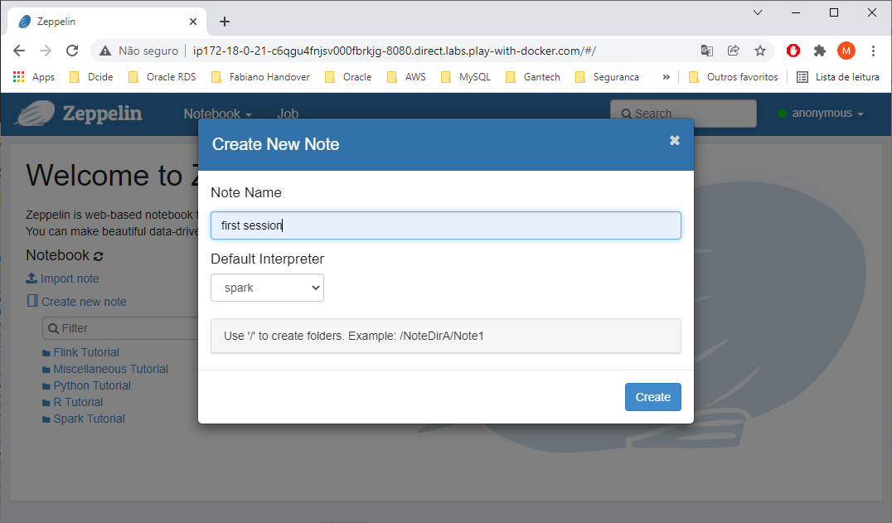
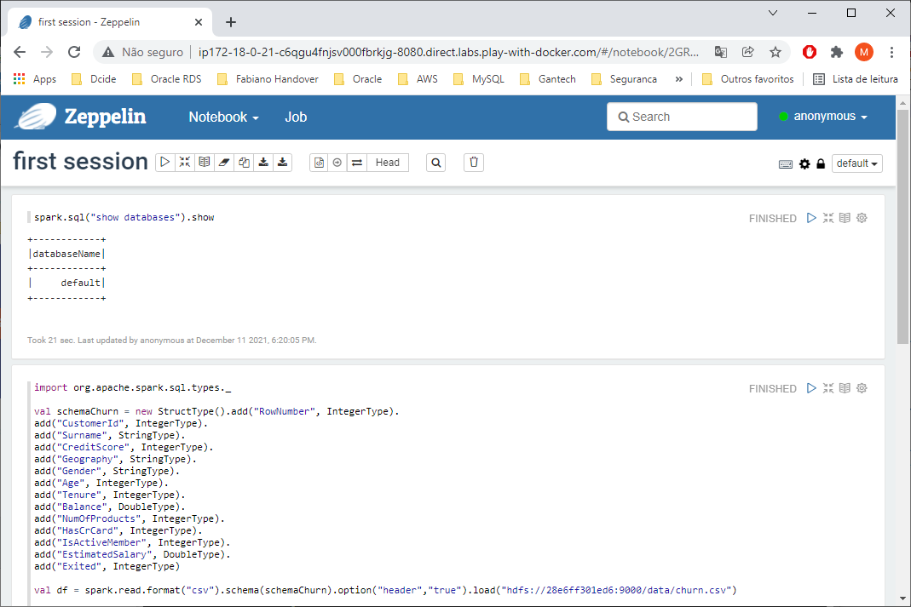

# Zeppelin client running into YARN cluster in Docker

Zeppelin is a web-based notebook which brings data exploration, visualization, sharing and collaboration features to Spark.

Apache Spark is an open-source, distributed processing system used for big data workloads.

In this demo, a Zeppelin/Spark container uses a Hadoop YARN cluster as a resource management and job scheduling technology to perform distributed data processing.

This Docker image contains Zeppelin and Spark binaries prebuilt and uploaded in Docker Hub.

## Build Zeppelin/Spark image
```shell
$ wget https://archive.apache.org/dist/spark/spark-2.3.2/spark-2.3.2-bin-hadoop2.7.tgz
$ wget https://downloads.apache.org/zeppelin/zeppelin-0.9.0/zeppelin-0.9.0-bin-netinst.tgz
$ docker image build -t mkenjis/ubzepp_img .
$ docker login   # provide user and password
$ docker image push mkenjis/ubzepp_img
```

## Start Swarm cluster

1. start swarm mode in node1
```shell
$ docker swarm init --advertise-addr <IP node1>
$ docker swarm join-token manager  # issue a token to add a node as manager to swarm
```

2. add 3 more workers in swarm cluster (node2, node3, node4)
```shell
$ docker swarm join --token <token> <IP node1>:2377
```

3. label each node to anchor each container in swarm cluster
```shell
docker node update --label-add hostlabel=hdpmst node1
docker node update --label-add hostlabel=hdp1 node2
docker node update --label-add hostlabel=hdp2 node3
docker node update --label-add hostlabel=hdp3 node4
```

4. create an external "overlay" network in swarm to link the 2 stacks (hdp and spk)
```shell
docker network create --driver overlay mynet
```

5. start the Hadoop cluster (with HDFS and YARN)
```shell
$ docker stack deploy -c docker-compose-hdp.yml hdp
$ docker stack ps hdp
jeti90luyqrb   hdp_hdp1.1     mkenjis/ubhdpclu_vol_img:latest   node2     Running         Preparing 39 seconds ago             
tosjcz96hnj9   hdp_hdp2.1     mkenjis/ubhdpclu_vol_img:latest   node3     Running         Preparing 38 seconds ago             
t2ooig7fbt9y   hdp_hdp3.1     mkenjis/ubhdpclu_vol_img:latest   node4     Running         Preparing 39 seconds ago             
wym7psnwca4n   hdp_hdpmst.1   mkenjis/ubhdpclu_vol_img:latest   node1     Running         Preparing 39 seconds ago
```

3. start a spark standalone cluster and spark client
```shell
$ docker stack deploy -c docker-compose.yml spk
$ docker service ls
ID             NAME           MODE         REPLICAS   IMAGE                                 PORTS
xf8qop5183mj   spk_spk_cli   replicated   0/1        mkenjis/ubzepp_img:latest
```

## Set up Zeppelin/Spark client

1. access spark client node
```shell
$ docker container ls   # run it in each node and check which <container ID> is running the Spark client constainer
CONTAINER ID   IMAGE                                 COMMAND                  CREATED         STATUS         PORTS                                          NAMES
8f0eeca49d0f   mkenjis/ubzepp_img:latest   "/usr/bin/supervisord"   3 minutes ago   Up 3 minutes   4040/tcp, 7077/tcp, 8080-8082/tcp, 10000/tcp   yarn_spk_cli.1.npllgerwuixwnb9odb3z97tuh
e9ceb97de97a   mkenjis/ubhdpclu_img:latest           "/usr/bin/supervisord"   4 minutes ago   Up 4 minutes   9000/tcp                                       yarn_hdp1.1.58koqncyw79aaqhirapg502os

$ docker container exec -it <spk_cli ID> bash
```

2. set Zeppelin binding address to 0.0.0.0 in $ZEPPL_HOME/conf/zeppelin-site.xml
```shell
$ cd $ZEPPL_HOME/conf   # this changes to /usr/local/zeppelin-0.9.0-bin-netinst/con
$ cp zeppelin-site.xml.template zeppelin-site.xml         
$ vi zeppelin-site.xml  # change the binding address to 0.0.0.0

<property>
  <name>zeppelin.server.addr</name>
  <value>0.0.0.0</value>
  <description>Server binding address</description>
</property>
```

3. start the Zeppelin service
```shell
$ $ZEPPL_HOME/bin/zeppelin-daemon.sh start
Zeppelin start                                             [  OK  ]
$
```

4. in the browser, issue the address https://host:8080 to access the Zeppelin Notebook.

At upper right corner, click on anonymous -> Interpreter.



It shows many interpreters Zeppelin can work. Scroll down and look for spark framework.



Click on "edit" button and setup the following parameters :
```shell
spark.master = yarn
spark.submit.deployMode = client
spark.driver.memory = 1024m
spark.yarn.am.memory = 1024m
spark.executor.memory = 1536m
```

Click on Save -> OK to update and restart Zeppelin

Create a new notebook clicking on Notebook -> Create New Note and provide the following as shown




Issue Spark commands




